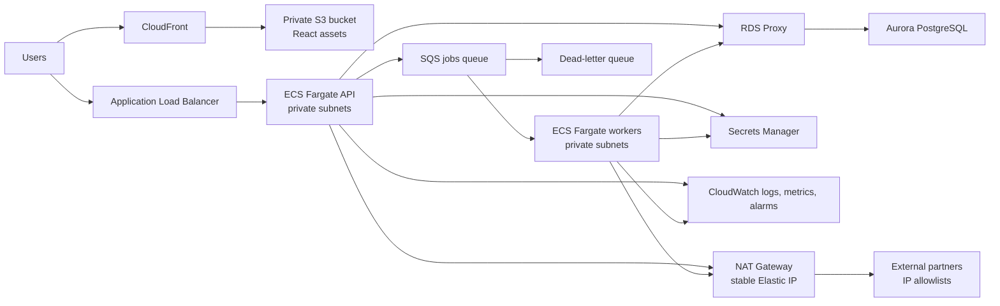

# Remarcable Infrastructure Demo

This is a Terraform demo for moving a small manually-deployed EC2 application
toward a more reliable AWS platform.

The current scenario is a single repo with a React frontend, Python backend,
PostgreSQL RDS, S3 object storage, and bash scripts run over SSH. The main pain
points are manual deploys, weak observability, memory-heavy work running in the
web path, and large database write bursts.

This repo implements the infrastructure demo option from the assignment:

> Infrastructure-as-code using Terraform that provisions a basic service with
> auto-scaling capabilities.

It does not deploy the real React/Python application. The API and worker services
run placeholder Nginx containers so the infrastructure can be reviewed without
needing the original app code.

## Architecture



## Why ECS Fargate

For this company, I would start with ECS Fargate rather than Kubernetes.

The team is small and the immediate problem is not container orchestration
complexity. The immediate problem is getting away from SSH deploys and giving the
app a safer runtime with health checks, autoscaling, central logs, IAM roles, and
repeatable infrastructure.

ECS Fargate gives us those things with less platform overhead than EKS. There are
no worker nodes to patch, no cluster autoscaler to tune, and fewer moving parts
for the first DevOps hire to own.

I have no issue using Kubernetes when the workload needs it. I would reach for
EKS later if the company needs Kubernetes-native tooling, multiple platform
teams, advanced rollout controllers, service mesh, or GitOps with ArgoCD/Flux as
the main deployment model. For the first 6-12 months, ECS is the simpler path.

## Why Split API and Workers

The current app slows down when large clients trigger expensive tasks. Those
tasks should not run inside the web request path.

The proposed split is:

- API service: handles user-facing HTTP requests and enqueues expensive jobs.
- Worker service: pulls jobs from SQS and does the memory-heavy or database-heavy
  work in the background.

This helps in a few practical ways:

- API requests return quickly instead of waiting for large jobs.
- Workers can scale on queue depth while the API scales on request load.
- A worker running out of memory does not take down the public API.
- Database writes can be batched and rate-limited in worker code.
- Failed jobs can land in a DLQ for investigation instead of disappearing.

This is the most important change in the design. It reduces the blast radius
before spending money on larger databases or a more complex platform.

## What This Demo Builds

The Terraform under `envs/demo` creates:

- VPC with public and private subnets
- NAT Gateway with a preallocated Elastic IP for partner allowlists
- optional VPC interface endpoints
- ECS Fargate API service behind an ALB
- ECS Fargate worker service
- SQS jobs queue and dead-letter queue
- Aurora PostgreSQL
- RDS Proxy
- Secrets Manager secrets
- private S3 bucket and CloudFront distribution for a React frontend
- CloudWatch log groups, alarms, SNS topic, and dashboard
- optional WAF on the API load balancer
- ECR repositories for future API and worker images

What actually runs:

- `remarcable-demo-api` runs `public.ecr.aws/nginx/nginx:1.27`.
- `remarcable-demo-worker` also runs `public.ecr.aws/nginx/nginx:1.27`.
- The frontend bucket and CloudFront distribution exist, but no React build is
  uploaded by this Terraform.

That is intentional for the demo. The goal is to show the platform pattern, not
to pretend this is the finished application deployment.

## Requirement Coverage

| Requirement | How this design addresses it |
| --- | --- |
| Ready for growth | ECS services can scale horizontally. API and workers scale independently. Aurora readers can be added when read load needs it. |
| Observable system | ECS logs go to CloudWatch. Container Insights is enabled. Alarms cover API errors, latency, queue depth, DLQ messages, worker task count, and Aurora CPU. |
| CI/CD | This repo includes a Terraform workflow. The desired app pipeline is described below. |
| Handle spikes | Heavy work moves to SQS workers. Workers scale on backlog. API stays focused on request/response traffic. |
| Fixed outbound IP | Private subnet egress goes through NAT Gateway Elastic IPs. Those IPs are output for partner allowlists. |
| Database scalability | Start with Aurora PostgreSQL plus RDS Proxy, batching, indexing, and read replicas before considering bigger changes. |
| Security | Private subnets, task IAM roles, Secrets Manager, private S3 with CloudFront OAC, optional WAF, and tagged resources. |

## Migration Plan

First 3 months:

1. Containerize the backend into API and worker images.
2. Add CI checks for linting, tests, and image builds.
3. Stand up the ECS API service behind an ALB.
4. Move expensive work out of API requests and into SQS workers.
5. Add CloudWatch logs, alarms, and a basic dashboard.
6. Keep the existing database engine, add RDS Proxy, and tune indexes and batch
   writes before adding more capacity.

Months 3-6:

1. Add a production Terraform root based on `envs/demo`.
2. Use one NAT Gateway per AZ for production resilience.
3. Enable VPC endpoints where they reduce NAT dependency or cost.
4. Add Aurora readers when read traffic justifies it.
5. Add safer deploys: smoke tests, rollback alarms, and canary or blue/green
   once deploy frequency increases.

Later:

1. Add OpenTelemetry traces and richer app/business metrics.
2. Split analytics/reporting workloads away from transactional queries if needed.
3. Consider EKS only if the team needs Kubernetes-native operations.
4. Consider multi-region only after there is a real business requirement for it.

## Database Approach

I would not start by changing the database technology. The safer first move is
to reduce pressure on the existing PostgreSQL workload.

The plan is:

- use Aurora PostgreSQL for managed failover and easier reader scaling
- put RDS Proxy in front of the database to smooth connection bursts from
  Fargate tasks
- move large writes into worker jobs
- batch writes instead of writing hundreds of thousands of rows one at a time
- make worker jobs idempotent so retries are safe
- add indexes based on real query plans, not guesses
- add Aurora readers for read-heavy paths
- separate analytics/reporting if those queries compete with the product path

RDS Proxy helps with provisioned Aurora. If this later moves to Aurora serverless,
I would revisit the proxy because persistent proxy connections can reduce the
benefit of scaling down.

## Naming

Resources follow this pattern where AWS allows custom names:

```text
${project}-${environment}-${component}[-purpose]
```

Examples:

- `remarcable-demo-vpc`
- `remarcable-demo-ecs`
- `remarcable-demo-api`
- `remarcable-demo-api-alb`
- `remarcable-demo-worker`
- `remarcable-demo-jobs`
- `remarcable-demo-jobs-dlq`
- `remarcable-demo-aurora-postgres`
- `remarcable-demo-rds-proxy`
- `remarcable-demo-frontend`

Secrets use path-style names:

```text
${project}/${environment}/${secret}
```

For example:

- `remarcable/demo/app`
- `remarcable/demo/db`

## Demo Assumptions and Shortcuts

Assumptions:

- The existing app can be split into API and worker containers.
- Expensive client tasks can be made asynchronous.
- Partners can allowlist one or more NAT Gateway Elastic IPs.
- The demo runs in an isolated AWS account.
- PostgreSQL remains the main transactional database during the migration.

Shortcuts:

- Nginx stands in for both the real API and worker images.
- Terraform creates frontend hosting but does not upload React assets.
- Observability is CloudWatch-only for the demo.
- The demo uses one NAT Gateway, no DB readers, no interface endpoints by
  default, and WAF disabled by default to reduce cost.
- Terraform creates initial secret values for the demo. I would not do that for
  production secrets.

## Cost Choices

`envs/demo/terraform.tfvars` is deliberately cheaper than production:

- `single_nat_gateway = true`
- `enable_interface_vpc_endpoints = false`
- `db_reader_count = 0`
- small Fargate tasks
- no custom domains or ACM certificates required
- WAF disabled by default

For production I would change those defaults:

- `single_nat_gateway = false`
- `enable_interface_vpc_endpoints = true`
- `db_reader_count = 1` or higher when read load needs it
- `deletion_protection = true`
- `enable_waf = true`
- larger API and worker max capacities
- real ACM certificates and DNS aliases

## Known Gaps

These are the main gaps I would close before production:

1. Memory-specific controls.
   Add ECS memory alarms, memory-based autoscaling where useful, OOM-exit
   alerts, and task sizing based on load tests.

2. Application observability.
   Add OpenTelemetry to the Python app, propagate trace context through SQS, and
   track business metrics such as job duration, queue age, rows written, failed
   partner calls, and client/task type.

3. Database hardening.
   Enable deletion protection and final snapshots. Tighten parameter settings
   after load testing. Add readers only when query data supports it.

4. Network hardening.
   The demo allows PostgreSQL from the VPC CIDR. Production should allow database
   access only from the API and worker task security groups.

5. Secret lifecycle.
   The demo is self-contained, so it creates some secret values through
   Terraform. Production should avoid putting real secret values in Terraform
   state.

## Terraform Backend Bootstrap

There are two bootstrap pieces outside this Terraform stack:

1. an S3 bucket for Terraform state
2. a GitHub Actions OIDC role for plan/apply

I keep these outside the demo stack because bootstrap identity and the resources
it manages have different lifecycles.

Create the state bucket once. For this demo it is just a basic S3 bucket used by
the Terraform backend:

```bash
BUCKET="remarcable-state-342677169881-us-east-1-an"
REGION="us-east-1"

aws s3api create-bucket --bucket "$BUCKET" --region "$REGION"
```

The backend uses Terraform's S3 lock file support, so there is no DynamoDB lock
table in this demo.

For production I would harden the state bucket with versioning, default
encryption, public access block, tighter bucket policies, access logging, and
lifecycle rules. I kept the bootstrap bucket simple here to keep the demo easy to
recreate and destroy.

For GitHub Actions, create an OIDC provider and role:

- OIDC provider: `token.actions.githubusercontent.com`
- IAM role: `arn:aws:iam::342677169881:role/github-actions-role`
- GitHub environment: `demo`

For this assignment, broad permissions are acceptable only in an isolated demo
account. In a real account, scope the role to the state bucket and the services
managed by this stack.

## Run, Inspect, and Destroy

Run the demo:

```bash
cd infra/envs/demo
tfenv install
terraform init

terraform plan
terraform apply
```

Use fresh AWS credentials before `terraform apply`. Aurora and CloudFront can
take long enough that short SSO sessions expire partway through.

Inspect the outputs:

```bash
terraform output
terraform output nat_public_ips
terraform output alb_dns_name
terraform output cloudfront_domain
terraform output sqs_queue_url
terraform output db_proxy_endpoint
```

Inspect ECS:

```bash
aws ecs describe-services \
  --cluster remarcable-demo-ecs \
  --services remarcable-demo-api remarcable-demo-worker \
  --region us-east-1
```

Inspect autoscaling:

```bash
aws application-autoscaling describe-scalable-targets \
  --service-namespace ecs \
  --region us-east-1

aws application-autoscaling describe-scaling-policies \
  --service-namespace ecs \
  --region us-east-1
```

Inspect logs and alarms:

```bash
aws logs describe-log-groups \
  --log-group-name-prefix /ecs/remarcable/demo \
  --region us-east-1

aws cloudwatch describe-alarms \
  --alarm-name-prefix remarcable-demo \
  --region us-east-1
```

If credentials expire and Terraform writes `errored.tfstate`, refresh your AWS
login before applying again:

```bash
cd infra/envs/demo
aws login
aws sts get-caller-identity
terraform state push errored.tfstate
terraform plan
```

Destroy the demo:

```bash
cd infra/envs/demo
terraform destroy
```

The frontend bucket has `force_destroy = true` outside production, so Terraform
can remove uploaded demo objects. The state bucket and GitHub OIDC role are
bootstrap resources and must be removed separately if no longer needed.

## Secrets

The demo generates the Aurora master password and Django secret with
`random_password`. That keeps the run instructions simple because there is no
manual `TF_VAR_db_password` to provide.

This does not keep the values fully out of Terraform state. Random provider
results are stored in state, and if Terraform writes a secret value into a
resource, that value can also be stored in state.

In this demo:

- the Aurora password is generated by Terraform
- Aurora receives the password through `master_password_wo`, which is a
  write-only provider argument
- the DB secret value is also seeded into Secrets Manager through Terraform, so
  that value can appear in state
- the app secret is generated by Terraform and written to Secrets Manager

For production, the cleaner pattern is:

1. Terraform creates or looks up the secret container only.
2. Terraform passes only the secret ARN to ECS.
3. A human operator, deployment pipeline, or secrets pipeline writes the secret
   value directly to Secrets Manager.
4. For RDS/Aurora, use AWS-managed password generation and rotation where
   possible.

This demo accepts the simpler state-backed secret tradeoff because it is easier
to run and review in an isolated account.

## Infrastructure CI/CD

`.github/workflows/tf-demo.yml` runs:

- `terraform fmt`
- `terraform init -backend=false`
- `terraform validate`
- `terraform plan`
- `terraform apply` on pushes to `main`

The workflow uses GitHub OIDC instead of long-lived AWS keys. It also uses GitHub
Actions concurrency plus Terraform state locking so two applies do not run
against the same environment at the same time.

## Desired Application CI/CD

Application delivery should be separate from infrastructure delivery. App
releases should not require a Terraform apply every time.

On pull requests:

1. run frontend and backend lint checks
2. run type and formatting checks
3. build the React frontend
4. build the Python API and worker images locally in CI
5. run unit tests and focused integration tests

On merge to `main`:

1. treat the merge commit as the release source
2. build the API and worker images once for that commit
3. push immutable image tags to ECR, ideally Git SHA tags plus recorded digests
4. upload frontend assets to S3 and invalidate CloudFront
5. update the deployment config with the new image digest

I would avoid running a second full lint/build/test cycle after merge if the PR
checks already validated the exact commit being released. In practice that means
using a merge queue or requiring branches to be up to date before merge. I would
still keep a small post-deploy smoke test.

If the platform later moves to EKS, ArgoCD or FluxCD can watch the application
deployment repo and roll out the new image digest. If the platform stays on ECS,
the equivalent is a pipeline or CodeDeploy updating ECS task definitions with the
immutable ECR digest.

## Adding Production Later

When this stops being a demo:

1. copy `envs/demo` to `envs/prod`
2. change the backend key to `prod/terraform.tfstate`
3. use a separate `terraform.tfvars` with production capacity and protection
4. add GitHub environment approval for production applies
5. keep the module layout the same unless production has a real extra need

## Next Steps

Given more time, I would:

1. replace the Nginx placeholders with real API and worker images
2. add the real frontend build and S3/CloudFront deploy
3. add ECS deployment circuit breakers, rollback alarms, and smoke tests
4. add OpenTelemetry traces through API requests and SQS jobs
5. add memory alarms and OOM alerts
6. tighten database security groups to task security groups
7. enable production secret rotation
8. add write batching and idempotent job processing in the worker code
